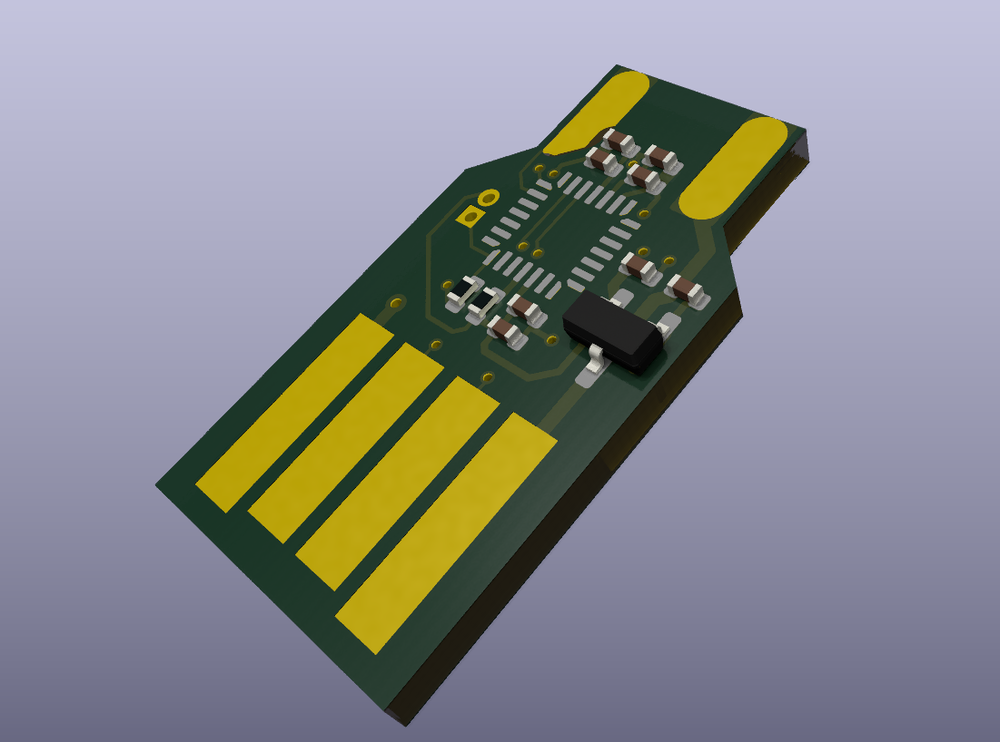

# IBM_Terminal_QMK_STM32_microadapter

My attempt to design a very small and very cheap USB converter for IBM Model M terminal keyboards.

Intended to fit in between the pins of a 5 pin DIN 270° female connector, with a PCB edge USB A connector.

The current design has flipped pins, a bad pinout, and is generally quite clunky.

